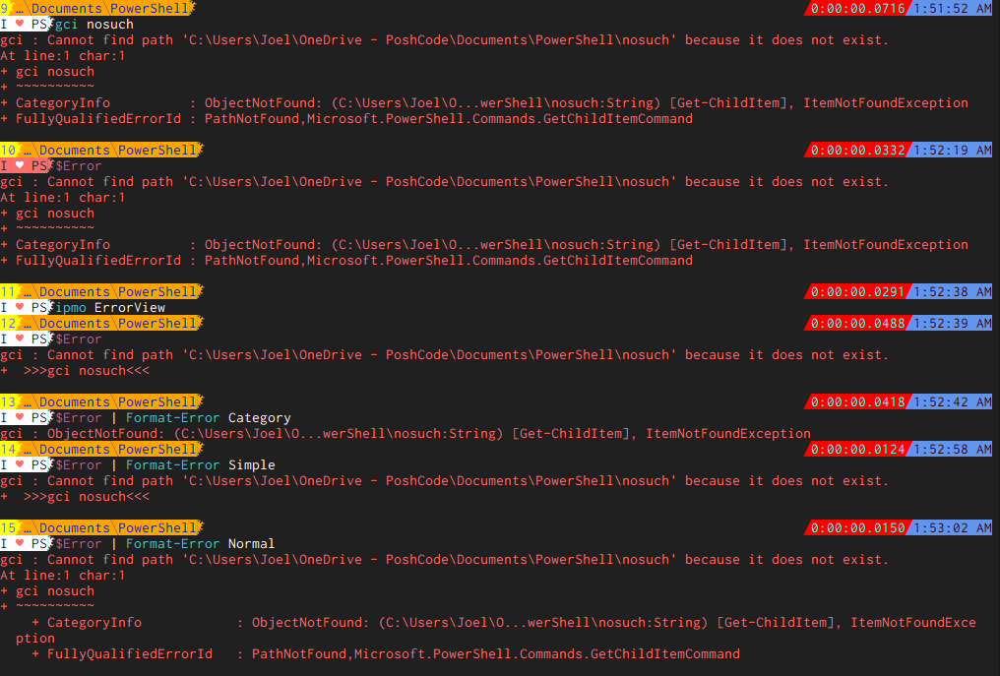

# PowerShell ErrorView

## A module to help customize your view of Errors in PowerShell

This is a _very_ simple module. It exports one important command: `Format-Error` and a handful of formatting commands:

* `ConvertTo-CategoryErrorView`
* `ConvertTo-NormalErrorView`
* `ConvertTo-SimpleErrorView`

But more importantly, _when it's imported_, it allows you to override PowerShell's error formatting by setting the global `$ErrorView` variable to something like "SingleLine" and writing a function `ConvertTo-SingleLineErrorView` (i.e. `ConvertTo-<name>ErrorView`), and of course, it provides a "Simple" error view on top of PowerShell's existing "Normal" and "Category" views.

